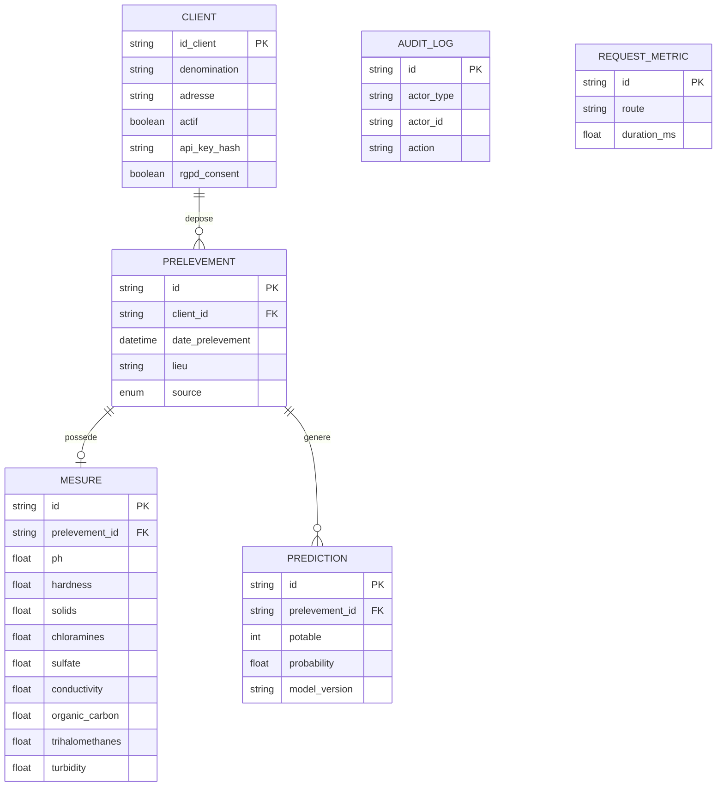

# Waterflow — Modélisation des données (MCD/MPD, formalisme Merise)

> Document de preuve : modélise le schéma de données réel du projet
> (`api/models/db.py`) selon le formalisme **Merise** (MCD — entités,
> associations, cardinalités — puis MPD), construit par lecture directe du
> code SQLAlchemy plutôt que par description approximative. Aucun document
> de ce type n'existait avant cette vérification — voir §5 pour l'écart
> trouvé dans `RAPPORT_CONFORMITE.md`, qui affirmait son existence.

## 1. Formalisme retenu

**Merise** (MCD puis MPD) — formalisme standard de l'enseignement français
en modélisation de données, adapté ici car :
- Le domaine est majoritairement relationnel classique (clients →
  prélèvements → mesures/prédictions), sans complexité d'héritage ou de
  polymorphisme qui justifierait UML/diagramme de classes.
- Le SGBD cible (SQLite en dev, PostgreSQL en prod via `DATABASE_URL`) est
  relationnel — Merise passe naturellement du MCD conceptuel au MPD
  relationnel sans transformation supplémentaire.

## 2. MCD — entités, associations, cardinalités

### 2.1 Diagramme

**`AUDIT_LOG` et `REQUEST_METRIC` sont volontairement isolées** (pas de
flèche vers `CLIENT`/`PRELEVEMENT` dans le diagramme) — cf. §4.

### 2.2 Cardinalités en notation Merise (X,Y)

| Association | Entité 1 | Cardinalité | Entité 2 | Cardinalité | Lecture |
|---|---|---|---|---|---|
| **DEPOSE** | CLIENT | (0,N) | PRELEVEMENT | (1,1) | Un client dépose 0 à N prélèvements ; un prélèvement appartient à exactement 1 client |
| **POSSEDE** | PRELEVEMENT | (0,1) | MESURE | (1,1) | Un prélèvement possède 0 ou 1 fiche de mesures ; une mesure appartient à exactement 1 prélèvement |
| **GENERE** | PRELEVEMENT | (0,N) | PREDICTION | (1,1) | Un prélèvement génère 0 à N prédictions (relance possible) ; une prédiction appartient à exactement 1 prélèvement |

Preuve dans le code (`api/models/db.py`) :
- **DEPOSE (1,1) côté PRELEVEMENT** : `client_id = Column(..., ForeignKey("clients.id"), nullable=False)` — jamais orphelin.
- **POSSEDE (0,1) côté PRELEVEMENT, (1,1) côté MESURE** : `Mesure.prelevement_id` est `unique=True` **et** la relation est déclarée `uselist=False` côté `Prelevement.mesures` — une seule fiche de mesures possible par prélèvement, jamais plusieurs (contrairement à `predictions`, qui n'a pas cette contrainte).
- **GENERE (0,N)** : `Prediction.prelevement_id` n'a **pas** de contrainte `unique` — plusieurs prédictions peuvent exister pour un même prélèvement (ex. si le modèle est relancé).

## 3. MPD — schéma physique

| Table | Colonne | Type | Contrainte |
|---|---|---|---|
| `clients` | `id` | `VARCHAR(36)` | PK |
| | `id_client` | `VARCHAR(64)` | UNIQUE, NOT NULL |
| | `denomination` | `VARCHAR(256)` | NOT NULL |
| | `adresse` | `TEXT` | NOT NULL |
| | `actif` | `BOOLEAN` | NOT NULL, défaut `true` |
| | `api_key_hash` | `VARCHAR(64)` | UNIQUE |
| | `rgpd_consent`, `rgpd_consent_at`, `anonymised_at` | `BOOLEAN`/`DATETIME` | — |
| `prelevements` | `id` | `VARCHAR(36)` | PK |
| | `client_id` | `VARCHAR(36)` | FK → `clients.id`, `ON DELETE CASCADE`, NOT NULL |
| | `source` | `ENUM('manual','ocr','api')` | défaut `api` |
| | *(+ 7 colonnes descriptives)* | | |
| `mesures` | `id` | `VARCHAR(36)` | PK |
| | `prelevement_id` | `VARCHAR(36)` | FK → `prelevements.id`, `ON DELETE CASCADE`, **UNIQUE**, NOT NULL |
| | `ph`…`turbidity` | `FLOAT` | 9 colonnes, nullable (mesures partielles possibles) |
| `predictions` | `id` | `VARCHAR(36)` | PK |
| | `prelevement_id` | `VARCHAR(36)` | FK → `prelevements.id`, `ON DELETE CASCADE`, NOT NULL (pas unique) |
| | `potable` | `INTEGER` | NOT NULL (0/1) |
| | `probability` | `FLOAT` | NOT NULL |
| | `model_version` | `VARCHAR(64)` | traçabilité de la version du modèle utilisée |
| `audit_logs` | `id` | `VARCHAR(36)` | PK |
| | `actor_type`, `actor_id`, `actor_role` | `VARCHAR` | pas de FK (cf. §4) |
| | index | `ix_audit_actor(actor_type, actor_id)` | |
| `request_metrics` | `id` | `VARCHAR(36)` | PK, aucune FK, table autonome |

Index supplémentaires : `ix_prev_client_date(client_id, date_prelevement)` sur `prelevements`.

## 4. Décisions de modélisation notables (trouvées en construisant ce document)

1. **Les experts (analyste/exploitation) ne sont pas une entité de la base.**
   Contrairement à ce qu'on pourrait attendre d'un MCD classique avec une
   entité `EXPERT`, les experts sont authentifiés via la variable
   d'environnement `EXPERT_TOKENS` (`login:token:role`), **hors base de
   données**. `AuditLog.actor_id` peut donc référencer soit un `id_client`
   (table `clients`), soit un login expert (qui n'existe dans aucune
   table) — d'où l'absence de clé étrangère réelle sur `actor_id` : il
   référence une entité **hétérogène**, pas une seule table, ce qui rend
   une FK classique impossible sans une table de jonction polymorphe
   (non implémentée — simplification MVP documentée ici, pas un oubli).
2. **`request_metrics` est intentionnellement déconnectée** de tout autre
   entité (pas de FK vers `clients`) — cohérent avec son rôle de métriques
   techniques purgeables périodiquement (mentionné dans le docstring du
   modèle), qui ne doivent pas entraîner de suppression en cascade de
   données métier si elles sont vidées.
3. **`MESURE` est en cardinalité (0,1) côté prélèvement**, pas (1,1) — un
   prélèvement peut exister sans mesures associées (ex. upload OCR dont
   l'extraction échoue partiellement) : `prediction_possible: false` dans
   l'API reflète directement ce cas de figure au niveau modèle de données.

## 5. Écart trouvé et corrigé

`RAPPORT_CONFORMITE.md` (analyse du 21/06/2026) affirmait : *« MCD incluant
clients, prélèvements, logs d'accès ✅ — `docs/mcd.md` complet avec MPD et
cardinalités »*. Ce fichier **n'existait pas** dans le dépôt avant la
construction du présent document (vérifié par `ls docs/mcd.md` avant
création). La ligne correspondante du rapport a été corrigée pour refléter
l'état réel et pointer vers ce document.

## 6. Limites

- Ce document modélise le schéma **actuellement implémenté**, pas un MCD
  conceptuel indépendant de l'implémentation — dans ce projet les deux
  coïncident car le schéma SQLAlchemy n'a jamais été retravaillé depuis sa
  conception initiale.
- Les enums (`ExpertRole`, `IngestionSource`) ne sont pas des entités
  Merise à part entière — `IngestionSource` est représenté comme attribut
  énuméré de `PRELEVEMENT` (`source`), conforme à son usage réel dans le
  code (une seule valeur par prélèvement, pas de relation).
