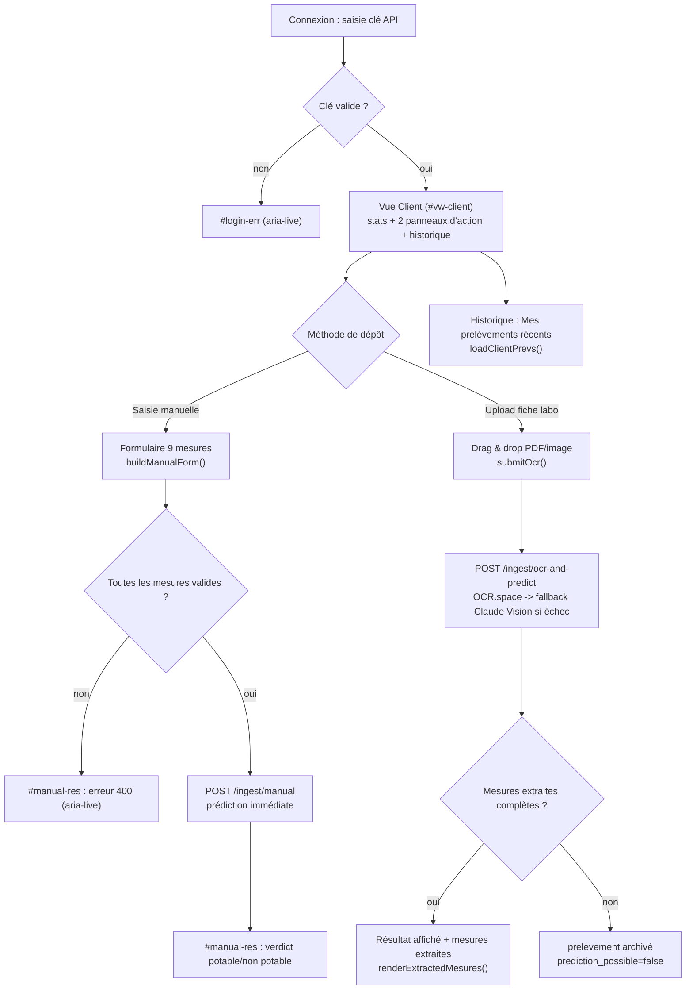
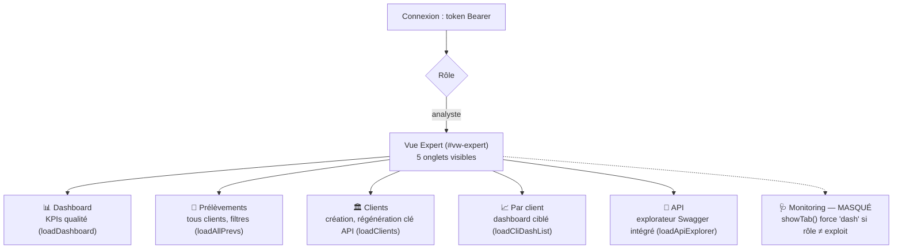
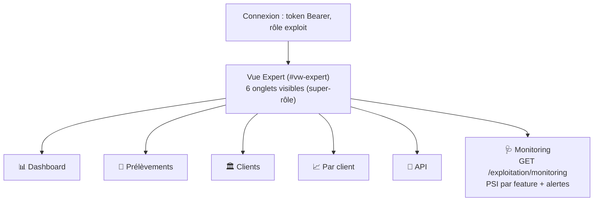

# Waterflow — Parcours utilisateurs (schéma fonctionnel + wireframes)

> Document de preuve : modélise les parcours réels des 3 profils
> (`docs/user_stories.md`) selon un formalisme **schéma fonctionnel**
> (diagramme de flux Mermaid, un par profil) et des **wireframes textuels**
> des deux vues de `templates/index.html`, construits par lecture directe
> du HTML/JS réel (`showApp()`, `showTab()`, `buildManualForm()`) plutôt que
> par description approximative. Complète `docs/user_stories.md` (le besoin,
> en texte) et `docs/architecture.md` (l'architecture technique) — aucun des
> deux ne modélise le parcours du point de vue de l'utilisateur.

## 1. Formalisme retenu

- **Schéma fonctionnel** (diagramme de flux, notation Mermaid `flowchart`) —
  un par profil, pour représenter les étapes et points de décision du
  parcours (ex. « saisie manuelle **ou** upload OCR », « rôle exploit
  → onglet Monitoring visible »).
- **Wireframes textuels** (ASCII, même registre que le diagramme
  d'architecture déjà présent dans `docs/architecture.md`) plutôt que des
  maquettes graphiques — cohérent avec le reste du projet (aucun outil de
  maquettage type Figma utilisé), suffisant pour représenter la disposition
  réelle des deux vues (`#vw-client`, `#vw-expert`) sans sur-outiller un
  projet à un seul contributeur.

Aucun des deux formalismes n'existait avant la construction de ce document
(vérifié : `grep -rl "wireframe\|parcours\|schéma fonctionnel" docs/*.md`
→ aucun résultat).

## 2. Parcours Client



Correspondance code : `showApp()` (branche `S.type === 'client'`),
`buildManualForm()`, `submitManual()`, `submitOcr()`.

## 3. Parcours Analyste



Point de vigilance hérité de `docs/user_stories.md` (US-07) — reporté ici
tel quel, non re-vérifié dans ce document : le statut d'exposition des 4
filtres (client, source, date début, date fin) dans le formulaire de
l'onglet **Prélèvements** restait à confirmer en recette finale.

## 4. Parcours Exploitation



Point de vigilance hérité de `docs/user_stories.md` (US-10) : `/exploitation/audit`
existe côté API mais n'a pas d'onglet dédié dans l'UI — absent du schéma
ci-dessus car absent du parcours réellement navigable (inscrit au backlog
produit, pas un oubli de ce document).

## 5. Wireframes textuels des deux vues réelles

### 5.1 Vue Client (`#vw-client`)

```
┌─────────────────────────────────────────────────────────────────┐
│ 💧 HWP   [Client]  COMM-042 · Mairie de Marseille    ●  Déconnexion│
├─────────────────────────────────────────────────────────────────┤
│  ┌──────────────┐ ┌──────────────┐ ┌──────────────┐              │
│  │ Prélèvements │ │  Potables    │ │ Non potables │              │
│  │      12      │ │      9       │ │      3       │              │
│  └──────────────┘ └──────────────┘ └──────────────┘              │
│  ┌────────────────────────────┐ ┌────────────────────────────┐  │
│  │ 🧪 Nouvelle analyse manuelle │ │ 📄 Upload fiche laboratoire │  │
│  │ [9 champs numériques]       │ │ ┌────────────────────────┐ │  │
│  │ [Analyser]                  │ │ │  📁  Glisser-déposer    │ │  │
│  │ (résultat aria-live)        │ │ │  PDF·PNG·JPG max 20 Mo  │ │  │
│  │                              │ │ └────────────────────────┘ │  │
│  └────────────────────────────┘ └────────────────────────────┘  │
│  ┌────────────────────────────────────────────────────────────┐ │
│  │ Mes prélèvements récents                    [Actualiser]    │ │
│  │ (tableau <table>/<thead>/<tbody> accessible clavier)         │ │
│  └────────────────────────────────────────────────────────────┘ │
└─────────────────────────────────────────────────────────────────┘
```

### 5.2 Vue Expert (`#vw-expert`) — nav variable selon le rôle

```
┌─────────────────────────────────────────────────────────────────┐
│ 💧 HWP  [exploit]  Responsable exploitation    ●                  │
│         📊 Dashboard  🧪 Prélèvements  🏛 Clients  📈 Par client   │
│         🔌 API  🩺 Monitoring ← visible SEULEMENT si rôle=exploit  │
├─────────────────────────────────────────────────────────────────┤
│  (contenu de l'onglet actif — un seul #tab-xxx visible à la fois, │
│   les 5 autres masqués via .hidden, cf. showTab())                │
└─────────────────────────────────────────────────────────────────┘
```

## 6. Limites

- Ces wireframes décrivent la disposition réelle (vérifiée dans le code
  HTML) mais restent une représentation textuelle basse fidélité — pas des
  maquettes graphiques pixel-parfaites (aucun outil de design UI utilisé
  sur ce projet, cohérent avec son échelle).
- Les schémas fonctionnels couvrent les parcours **principaux** de chaque
  profil (US-01 à US-10) ; les parcours d'erreur secondaires (ex. session
  expirée, clé API régénérée pendant une session active) ne sont pas
  détaillés ici — cf. `docs/owasp.md` pour le comportement d'authentification.
- Les deux points de vigilance hérités de `docs/user_stories.md` (§3, §4)
  n'ont pas été re-vérifiés dans le cadre de la construction de ce
  document — reportés tels quels depuis la source la plus récente connue.
